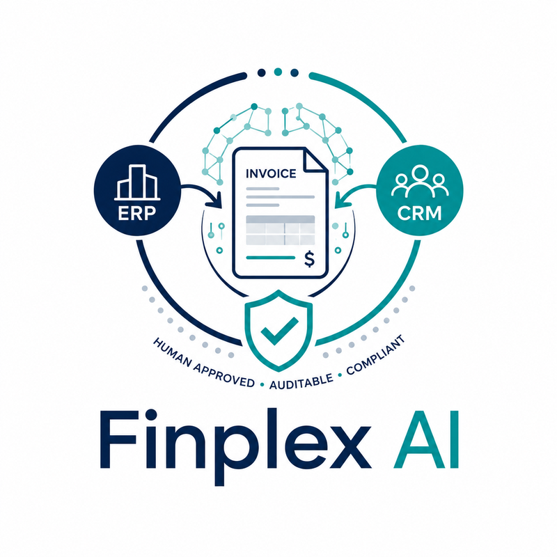
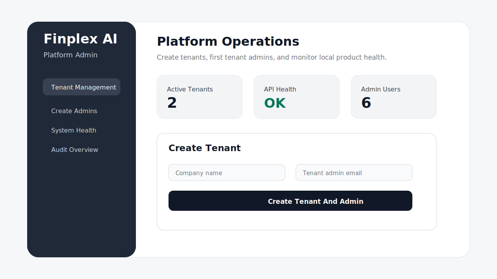
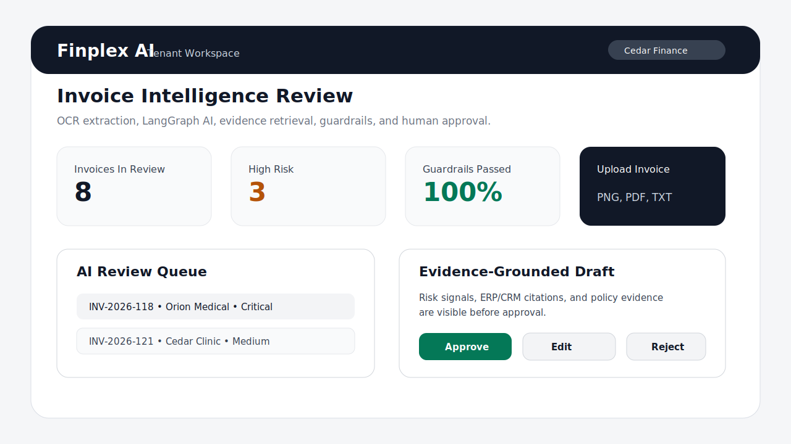

<div align="center">
  

  <h1>Finplex AI</h1>

  <p><strong>AI Invoice Intelligence &amp; Responsible Payment Follow-Up for FinTech SaaS</strong></p>

  <p>
    Connect invoice uploads, ERP payment records, CRM context, AI risk scoring, guardrails, and human approval into one tenant-isolated workflow.
  </p>

  <p>
    
    
    
    
    
    
    
  </p>

  <p>
    <a href="#product-interface-previews">Demo</a> ·
    <a href="#architecture">Architecture</a> ·
    <a href="#local-setup">Quick start</a> ·
    <a href="#documentation">Docs</a> ·
    <a href="#suggested-review-path">For reviewers</a>
  </p>
</div>

---

Finplex AI is a local-first FinTech SaaS product for invoice intelligence and responsible payment follow-up. It connects invoice uploads, ERP-style payment records, CRM-style customer context, OCR/text extraction, LangGraph orchestration, LangChain Core nodes, ML risk scoring, pgvector RAG retrieval, LLM-style draft generation, guardrails, and human approval into one tenant-isolated workflow.

The product has two user surfaces:

- **Streamlit Platform Admin** for internal Finplex operators. Platform admins create tenants, create the first tenant admin, inspect tenant status, and monitor system health.
- **React Tenant Workspace** for finance teams. Tenant users upload invoices, inspect customer intelligence, review AI recommendations, approve or reject follow-up drafts, and view decision history.

There is no public sign-up. A platform admin creates a tenant first, then creates the first tenant admin. Tenant admins manage users inside their own tenant.

## Product Interface Previews

### Streamlit Platform Admin



### React Tenant Workspace



## Product Flow

```text
Platform Admin creates tenant
        ↓
Platform Admin creates first tenant admin
        ↓
Tenant Admin creates managers and reviewers
        ↓
Tenant user uploads invoice
        ↓
Backend stores invoice and publishes processing event
        ↓
Worker extracts invoice text/OCR payload
        ↓
Model-server runs LangGraph + LangChain Core orchestration
        ↓
Pipeline scores risk, retrieves evidence, and drafts a follow-up
        ↓
Guardrails validate the draft
        ↓
Reviewer sees extracted fields, evidence, risk reasons, and draft
        ↓
Human approves, edits, or rejects
        ↓
Audit log stores the decision with tenant_id and trace_id
```

## Architecture

```text
apps/admin             Streamlit platform admin console
apps/web               React tenant workspace
services/api           FastAPI product API, auth, RBAC, tenant isolation
services/workers       Kafka consumers, local OCR/text extraction, async jobs
services/model-server  LangGraph/LangChain AI pipeline, extraction, RAG, risk, drafting
services/guardrails    Policy checks for safe customer-facing drafts
infra                  Local Docker infrastructure scripts
models                 Trained risk model artifacts and metadata
notebooks              Training and evaluation notebooks
regulations            Human-readable and machine-readable policy rules
evals                  Golden evaluation scripts and thresholds
docs                   Architecture, setup, security, runbook, and review docs
```

## Core Technologies

| Layer | Tools |
|---|---|
| Frontend | React, TypeScript, Vite |
| Admin console | Streamlit |
| Backend | FastAPI, Pydantic, SQLAlchemy, Alembic |
| Data | PostgreSQL, pgvector, Redis, MinIO |
| Events | Apache Kafka, Zookeeper |
| AI orchestration | LangGraph, LangChain Core `RunnableLambda` nodes |
| AI capabilities | Local OCR/text extraction, ML risk scoring, pgvector RAG, LLM-style drafting, guardrails |
| Quality | pytest, ruff, TypeScript build, golden evals, GitHub Actions |

## Prerequisites

Install these before running the project:

- Git
- Docker and Docker Compose
- Python managed by `uv`
- Node.js 20+
- npm
- GitHub CLI, only if you want to create pull requests from the terminal

## Local Setup

Clone the repository and enter it:

```bash
cd ~
git clone git@github.com:hosen20/finplex-ai.git
cd finplex-ai
```

Create a local environment file:

```bash
cp -n .env.example .env
```

Install Python dependencies:

```bash
uv sync --all-packages
```

Install React dependencies:

```bash
cd apps/web
npm install
cd ../..
```

Start infrastructure:

```bash
make infra-up
```

Apply database migrations:

```bash
cd services/api
uv run alembic -c alembic.ini upgrade head
cd ../..
```

Create or update the first platform admin:

```bash
uv run --project services/api python scripts/bootstrap-platform-admin.py \
  --email platform.admin@finplexai.com \
  --full-name "Finplex Platform Admin" \
  --password "FinplexAdmin123!"
```

Seed local product data:

```bash
bash scripts/seed-local-data.sh
```

## Running The Product

Use separate terminals.

Terminal 1: API

```bash
cd ~/finplex-ai
make api
```

Terminal 2: model server

```bash
cd ~/finplex-ai
make model-server
```

Terminal 3: guardrails service

```bash
cd ~/finplex-ai
make guardrails
```

Terminal 4: workers

```bash
cd ~/finplex-ai
make workers
```

Terminal 5: Streamlit admin console

```bash
cd ~/finplex-ai
make admin
```

Open:

```text
http://localhost:8501
```

Terminal 6: React tenant workspace

```bash
cd ~/finplex-ai/apps/web
npm run dev
```

Open:

```text
http://localhost:5173
```

## Seeded Product Accounts

Platform admin:

```text
platform.admin@finplexai.com / FinplexAdmin123!
```

Tenant users created by the local seed command:

```text
tenant_admin@cedarfinance.com / TenantAdmin123!
manager@cedarfinance.com / TenantAdmin123!
reviewer@cedarfinance.com / TenantAdmin123!
auditor@cedarfinance.com / TenantAdmin123!

tenant_admin@orionmedical.com / TenantAdmin123!
manager@orionmedical.com / TenantAdmin123!
reviewer@orionmedical.com / TenantAdmin123!
auditor@orionmedical.com / TenantAdmin123!
```

## Suggested Review Path

1. Run infrastructure, migrations, seed data, and services.
2. Open Streamlit and verify platform-admin tenant management.
3. Open React and sign in as a seeded tenant admin or reviewer.
4. Upload a sample invoice image from `data/demo_invoices/manual_upload_images/`.
5. Verify that the worker extracts OCR text, the model-server runs LangGraph, guardrails pass, and a review is created.
6. Approve or reject the draft and verify invoice status and audit history.
7. Run the quality gate.

## Quality Gate

Run the same checks used by CI:

```bash
bash scripts/check-secrets.sh
bash scripts/lint.sh
bash scripts/test.sh
bash scripts/run-evals.sh
```

The main GitHub Actions workflow is defined in:

```text
.github/workflows/ci.yml
```

The golden evaluation thresholds are defined in:

```text
evals/eval_thresholds.yaml
```

## Documentation

Start here:

```text
docs/PROJECT_REVIEW_GUIDE.md
docs/FINAL_REVIEW_CHECKLIST.md
docs/LOCAL_SETUP.md
docs/ARCHITECTURE.md
docs/STREAMLIT_ADMIN.md
docs/TENANT_WEB_APP.md
docs/PRODUCT_AI_PIPELINE.md
docs/LANGGRAPH_ORCHESTRATION.md
docs/OCR_INVOICE_EXTRACTION.md
docs/RAG_PGVECTOR.md
docs/EVALUATIONS.md
docs/SECURITY.md
docs/RUNBOOK.md
```

## Product Scope

Finplex AI is currently a local-first product. It is designed to be reviewed, run, and tested locally with Docker infrastructure and local services. Public sign-up is intentionally not included because tenant onboarding is controlled by the Streamlit Platform Admin console.
